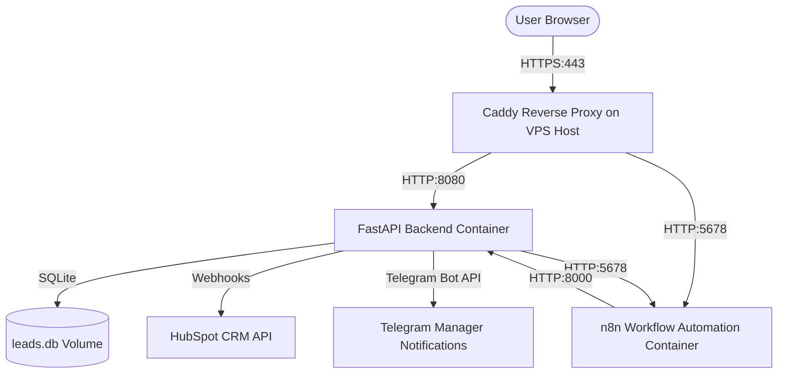

# Production Deployment Guide — Lead-to-CRM Autopilot

This guide provides step-by-step instructions for deploying and maintaining the **Lead-to-CRM Autopilot** stack on an Ubuntu 24.04 VPS with automated HTTPS reverse proxying via Caddy.

---

## 1. System Architecture Overview

The production stack utilizes a hybrid Dockerized + Host-native deployment for maximum security, performance, and simplicity:



### Stack Components:
1. **FastAPI Application (Container):** Handles dashboard, lead ingestion API, AI draft processing, and event logs.
2. **n8n Automation Engine (Container):** Manages long-running scheduled SLA checks and webhook orchestration.
3. **SQLite Database (Local File):** Embedded DB stored inside the Docker volume for persistent lead state.
4. **Caddy Server (Host-Native):** Acts as a high-performance reverse proxy that automatically obtains and renews SSL/TLS certificates (Let's Encrypt / ZeroSSL) for your domains.

---

## 2. Remote VPS Prerequisites

Ensure your Ubuntu 24.04 VPS (`146.103.40.34`) has the following ready:
- **Ports Open:** Port 80 (HTTP) and Port 443 (HTTPS) must be open on the firewall.
- **Docker & Compose:** Verify installation with:
  ```bash
  docker --version
  docker compose version
  ```
- **Domain Mappings:** Ensure your DuckDNS subdomains point to the VPS IP (`146.103.40.34`):
  - `vestint.duckdns.org` (Main Dashboard & Ingestion API)
  - `vestint-n8n.duckdns.org` (n8n Webhook & Workflow Console)

---

## 3. Codebase Packaging & Transfer

We avoid transferring heavy local folders (such as `.venv/`, node modules, or `.git/`) by creating a clean source tarball on the development machine and copying it via Secure Copy (`scp`).

### Step 1: Create a Clean Tarball (Dev Machine)
Open PowerShell in the project directory and run:
```powershell
tar -czf autopilot.tar.gz app services static Caddyfile Dockerfile docker-compose.yml main.py models.py requirements.txt
```

### Step 2: Upload to the VPS
Upload the tarball and your current production `.env` file directly to the VPS:
```powershell
scp -i C:/Projects/.secret/telegram_server autopilot.tar.gz root@146.103.40.34:/root/
scp -i C:/Projects/.secret/telegram_server .env root@146.103.40.34:/root/
```

### Step 3: Extract on the VPS
Connect to the VPS via SSH and extract the files into the deployment directory:
```bash
# Connect to VPS
ssh -i C:/Projects/.secret/telegram_server root@146.103.40.34

# Extract tarball
mkdir -p /root/workshop-lead-autopilot
tar -xzf /root/autopilot.tar.gz -C /root/workshop-lead-autopilot
mv /root/.env /root/workshop-lead-autopilot/.env
rm /root/autopilot.tar.gz
```

---

## 4. Install & Configure Caddy (Host-Native)

Ubuntu 24.04 includes Caddy 2.6+ in its default universe repository, making setup extremely straightforward.

### Step 1: Install Caddy
Run the following commands on the VPS:
```bash
sudo apt update
sudo apt install -y caddy
```

### Step 2: Configure Caddyfile
Copy the project Caddyfile to the system Caddy folder:
```bash
cp /root/workshop-lead-autopilot/Caddyfile /etc/caddy/Caddyfile
```

*Note: Ensure `/etc/caddy/Caddyfile` contains your correct domains:*
```caddy
# Lead-Autopilot App Dashboard & API
vestint.duckdns.org {
    reverse_proxy localhost:8080
}

# n8n webhook and workflow editor
vestint-n8n.duckdns.org {
    reverse_proxy localhost:5678
}
```

### Step 3: Start and Enable Caddy
Enable the service so it starts automatically on system boot, and reload the configuration:
```bash
sudo systemctl enable caddy
sudo systemctl restart caddy
```

---

## 5. Environment Variables & Production LLM Choice

In `/root/workshop-lead-autopilot/.env`, review and adjust the variables:

```ini
# Production LLM API Selection (Choose Option A or B)
# Option A: Cloud API (e.g., Gemini - Recommended for production stability)
LLM_BASE_URL=https://generativelanguage.googleapis.com/v1beta/openai/
LLM_MODEL=gemini-1.5-flash
LLM_API_KEY=YOUR_GEMINI_API_KEY

# Option B: Local Host Tunnel (Points to local LM Studio via secure tunnel or host gateway if loaded on VPS)
# LLM_BASE_URL=http://host.docker.internal:1234/v1
# LLM_MODEL=google/gemma-4-e4b
# LLM_API_KEY=lm-studio

AGENCY_NAME=Vestint
HUBSPOT_TOKEN=YOUR_HUBSPOT_PRIVATE_APP_TOKEN
TELEGRAM_ENABLED=true
TELEGRAM_BOT_TOKEN=YOUR_TELEGRAM_BOT_TOKEN
TELEGRAM_CHAT_IDS=YOUR_TELEGRAM_CHAT_IDS
SUPABASE_URL=https://gsmtgsplagfcxulmsbpb.supabase.co
SUPABASE_KEY=YOUR_SUPABASE_SERVICE_ROLE_KEY
```

---

## 6. Launch the Docker Stack

Navigate to the project folder on the VPS and build/launch the containers:
```bash
cd /root/workshop-lead-autopilot
docker compose up --build -d
```

### Verify Container Health:
Ensure both containers are up and healthy:
```bash
docker compose ps
```

---

## 7. Verification Rituals

Verify that all services are live and encrypted:

1. **Check FastAPI Dashboard:** Open [https://vestint.duckdns.org](https://vestint.duckdns.org) in a browser. It should load instantly with a green padlock (valid Let's Encrypt SSL certificate).
2. **Check n8n Panel:** Open [https://vestint-n8n.duckdns.org](https://vestint-n8n.duckdns.org) in a browser to access the automation workspace.
3. **Verify API Health:**
   ```bash
   curl -fsI https://vestint.duckdns.org/health
   # Expected output: HTTP/2 200 OK
   ```

---

## 8. Ongoing Maintenance & Operations

### Viewing Live Logs:
- **FastAPI Application Logs:**
  ```bash
  docker compose logs -f app
  ```
- **n8n Logs:**
  ```bash
  docker compose logs -f n8n
  ```
- **Caddy Reverse Proxy Logs:**
  ```bash
  journalctl -u caddy -f --no-pager
  ```

### Database Persistence:
The SQLite database is kept inside the host filesystem to ensure data persists across rebuilds. To backup the database:
```bash
cp /root/workshop-lead-autopilot/leads.db /root/backups/leads_$(date +%F).db
```

### Rebuilding After Code Updates:
When new code changes are pushed to the VPS, rebuild the stack gracefully:
```bash
docker compose up --build -d
```
